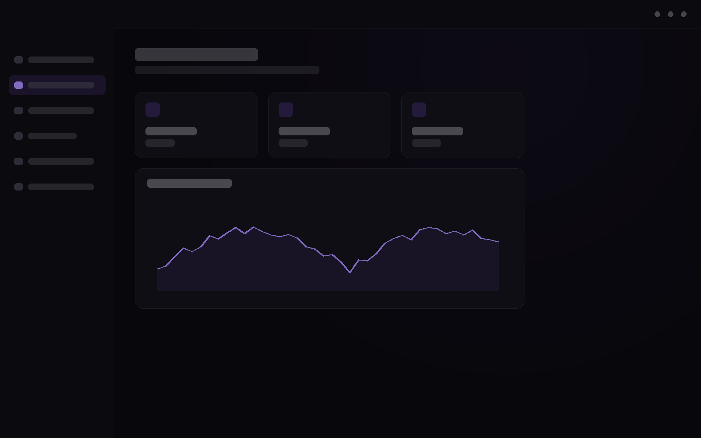

# ⚡ SOLARA

  <h3>Modern. Fast. Reliable.</h3>

  

    A powerful execution environment with a clean interface, 
    smooth animations and a seamless user experience.
  

   

  
  &nbsp;
  

   

  

---

## ✨ About

**Solara** is a modern and lightweight execution environment focused on performance, simplicity and a clean user interface.

Built with a responsive design, smooth animations and an easy-to-use experience for maximum efficiency.

---

## 📥 Download

  
Download the latest version of Solara V3.

   

  

---

## 🖼️ Preview

  

---

## 🛠️ Built With

  
  &nbsp;
  
  &nbsp;
  

---

<b>⚡ SOLARA</b>

  

Built with passion.

